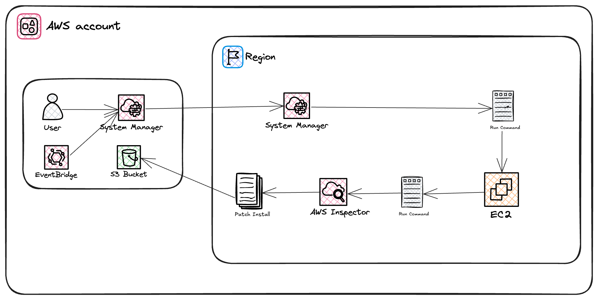
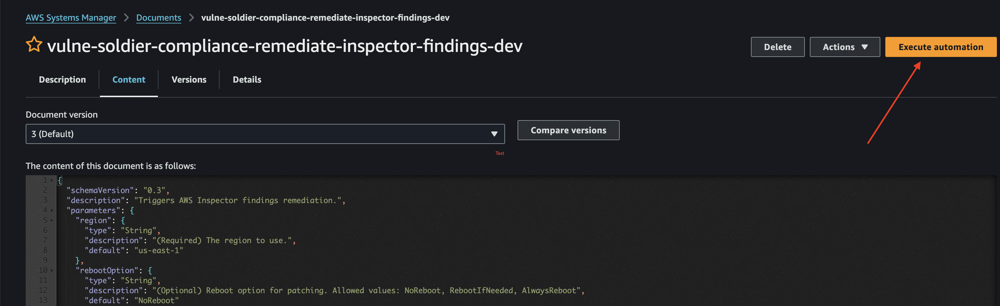

# vulne-soldier: A Modern Day AWS EC2 Vulnerability Remediation Tool

[](https://registry.terraform.io/modules/iKnowJavaScript/vulne-soldier/aws/latest)
[](https://www.terraform.io)
[](https://opensource.org/licenses/MIT)

This Terraform module consists of the configuration for automating the remediation of AWS EC2 vulnerabilities using AWS Inspector findings. It provisions essential resources such as an SSM document, Lambda function, and CloudWatch event rules for automated vulnerability management.

## Prerequisites

> **Important**
>
> The AWS Systems Manager (SSM) agent **must be installed and running** on all EC2 instances you wish to remediate. Without SSM, this module cannot trigger remediation actions on your instances.

## Description

This Terraform module sets up an automated vulnerability remediation environment optimized for production use. By creating an SSM document to define the remediation steps, setting up a Lambda function to execute the remediation, and establishing CloudWatch event rules to trigger the process based on AWS Inspector findings, the module offers a straightforward approach to managing EC2 vulnerabilities on AWS.

This module provisions:

- AWS SSM documents
- AWS Lambda functions
- AWS CloudWatch event rules
- IAM roles and policies




## Usage

### Setup terraform module

#### Download lambda

To apply the terraform module, the compiled lambdas (.zip files) need to be available locally. They can either be downloaded from the GitHub release page or built locally.

> **Info**

> The lambdas can be downloaded from the [release page](https://github.com/iKnowJavaScript/terraform-aws-vulne-soldier/releases) or by building the Lambda folder using Node.

For local development you can build the lambdas at once using `/lambda` or individually using `npm zip`.

### Example Configuration

To deploy the `vulne-soldier` module, you can use the following configuration in your Terraform setup:

```hcl
module "remediation" {
  source = "../../"

  name             = "vulne-soldier-compliance-remediate"
  environment      = "dev"
  aws_region       = "us-east-1"
  account_id       = "2123232323"
  lambda_log_group = "/aws/lambda/vulne-soldier-compliance-remediate"
  path_to_lambda_zip       = "./lambda.zip"
  remediation_options = {
    region                                     = "us-east-1"
    reboot_option                              = "NoReboot"
    # You need to specify the tag name and value of the EC2 instances you want to remediate
    target_ec2_tag_name                        = "AmazonECSManaged"
    target_ec2_tag_value                       = "true"
    # You can specify the vulnerability severities to filter findings: default is CRITICAL and HIGH vulnerabilities
    vulnerability_severities                   = ["CRITICAL, HIGH"]
    override_findings_for_target_instances_ids = []
  }
  remediation_schedule_days = ["15", "L"] # Schedule remediation on the 15th and last day of each month
  ssm_notification_topic_arn = null # Optional: Specify an SNS topic ARN to receive notifications for remediation events
}

provider "aws" {
  region = "us-east-1"
}
```

### Triggers Remediation Process

On successful deployment, navigate to the AWS Systems Manager console and search for the SSM document created by the module (vulne-soldier-compliance-remediate-inspector-findings) or similar. You can trigger the remediation process by running the document on the affected EC2 instances. You can also create an AWS CloudWatch event rule to automate the process based on AWS Inspector findings.


## What's New in v2

- Remediation is now **automated** using EventBridge rules, running by default with the `NoReboot` option for minimal disruption. You can update this option as needed in your configuration.

## Walkthrough Video

[](assets/v2-walkthrough.mov)

> Watch the [v2 walkthrough video](assets/v2-walkthrough.mov) for a step-by-step demonstration of setup and usage.

## Inputs

| Name                                     | Description                                                                 | Type          | Default                                    | Required |
|------------------------------------------|-----------------------------------------------------------------------------|---------------|--------------------------------------------|:--------:|
| `name`                                   | Name of the application                                                     | `string`      | n/a                                        | yes      |
| `environment`                            | Name of the environment                                                     | `string`      | n/a                                        | yes      |
| `aws_region`                             | AWS region where the resources will be created                              | `string`      | n/a                                        | yes      |
| `account_id`                             | AWS account ID                                                              | `string`      | n/a                                        | yes      |
| `lambda_log_group`                       | Name of the CloudWatch Log Group for the Lambda function                    | `string`      | n/a                                        | yes      |
| `path_to_lambda_zip`                             | File location of the lambda zip file for remediation                                                              | `string`      | `lambda.zip`                                        | yes      |
| `remediation_options`                    | Options for the remediation document                                        | `object list`      | n/a                                        | yes      |
| `remediation_options.region`             | The region to use                                                           | `string`      | `us-east-1`                                | no       |
| `remediation_options.reboot_option`      | Reboot option for patching                                                  | `string`      | `NoReboot`                                 | no       |
| `remediation_options.target_ec2_tag_name`| The tag name to filter EC2 instances                                        | `string`      | `AmazonECSManaged`                         | no       |
| `remediation_options.target_ec2_tag_value`| The tag value to filter EC2 instances                                       | `string`      | `true`                                     | no       |
| `remediation_options.vulnerability_severities`| Comma separated list of vulnerability severities to filter findings                        | `string`| `"CRITICAL, HIGH"`                       | no       |
| `remediation_options.override_findings_for_target_instances_ids`| Comma separated list of instance IDs to override findings for target instances              | `string`| `""`                                       | no       |
| `remediation_schedule_days`              | Days of the month to schedule remediation (e.g., ["15", "L"])               | `list(string)`| `["15", "L"]`                             | no       |
| `ssm_notification_topic_arn`             | SNS topic ARN to receive notifications for remediation events (optional) | `string`      | `null`                                     | no       |

## Outputs

| Name                  | Description                  | Sensitive |
|-----------------------|------------------------------|:---------:|
| `lambda_function_arn` | Lambda function ARN          | No        |
| `lambda_function_name`| Lambda function name         | No        |
| `ssm_document_name`   | SSM document name            | No        |

To retrieve outputs, use the `terraform output` command, for example: `terraform output lambda_function_arn`.

## License

This project is licensed under the MIT License - see the LICENSE.md file for details.